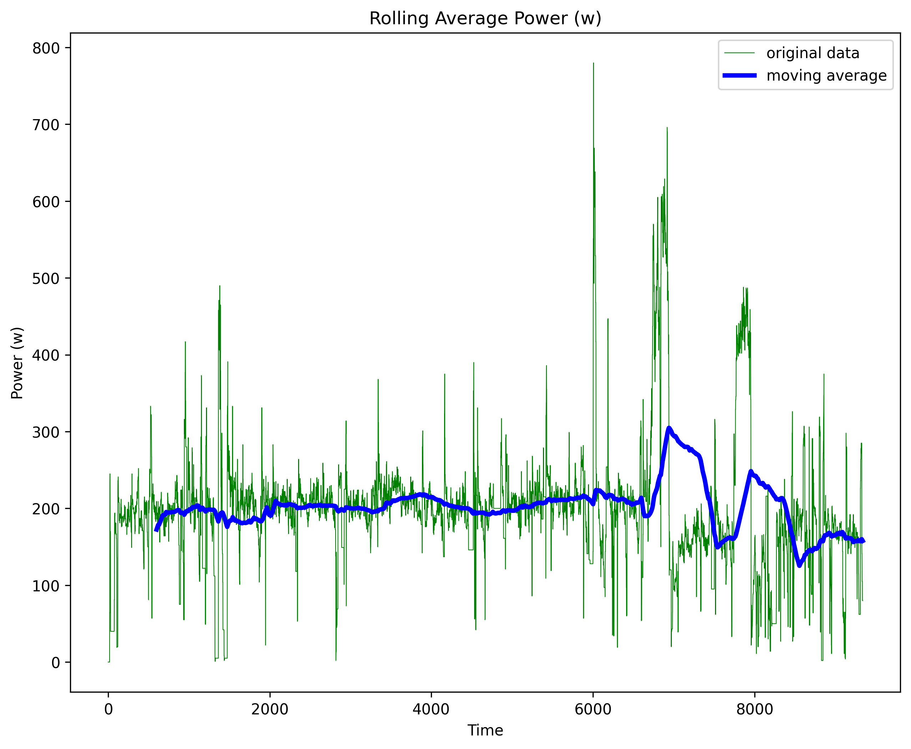

# Moving Averages Coding Challenge

This was a very enjoyable take-home challenge for an internship application.

The challenge details can be found in `challenge.md`.

Thank you for a great challenge _**DA**_ (you know who you are!)

### Design decisions

I opted to use pandas for the data processing. 
Pandas provides a convenient function `rolling()` to create moving averages.

When processing the data I assumed (as advised) that the data should follow a step-function, 
where missing values are populated with the previous valid values. 
Once again pandas provides a convenient function for this, `fillna()`, which fills missing values.

### Output


### Run

1. Create and activate virtualenv environment
2. Install from the requirements.txt
3. Run rolling_averages.py

```
python -m venv venv
.\venv\Scripts\activate
pip install --upgrade pip
pip install -r requirements.txt
python rolling_averages.py
```

A time stamped image (showing the rolling average, overlaying the original data) will be saved in the working directory. Eg `.\rolling_average_15_23_14.png`
